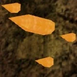
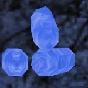

# __Undercliffs__

!!! quote "Map Description"
    "High atop the cliffs and craggy bluffs of the Underworld, danger and mystery await..."

!!! info inline end ""

    

    
**Undercliffs, Boss Chamber**

## __Overview__

In the Undercliffs existed a town built by dwarves after the Age of Blood. Located atop bloodrose, the town survived on trade between elves and humans, just as Mynath did. After Mynath was destroyed however, the dwarven town could no longer trade, and went into decline. It is now home to spiders and the spirits of those who have lived there.

Undercliffs features many powerful spider with potent poison damage. Attempting it without any poison immunity may lead to you dying several times to spiders that have the ability to do hundreds of damage through Lord Vecilus' Mail. Spider Protection Potions are recommended for attempting the map as it makes the bosses deal much less damage. Undercliffs is also a great place for replenishing your potion stock, as most of the chests drop lots of high tier potions such as Fire Brand Potions and Greater Protection Potions.

## __Bosses__

The Undercliffs has three unique bosses, although only one of the bosses gives unique loot, the Latrodectus Prismus. The first two bosses, the Wicked Widow and the Adamantium Spider are essentially beefed-up standard boss spiders. They walk at you and attack you with melee only, although the Adamantium Spider has more physical damage resistances. The Latrodectus Prismus however, will teleport on various surfaces or on the ceiling and shoot projectiles at you, or teleport to you and attempt to melee attack. Each boss has their respective set of three Individual Chests after they die. For each boss to spawn, the map must meet specific requirements.

### __Wicked Widow__

The Wicked Widow is the first boss you usually fight there. Making the Wicked Widow appear isn't too difficult, being that you just need to kill a fair amount of White Widow spiders located throughout the map. Once killed, it will spawn three variants of the Wicked Widow Chest.

### __Adamantium Spider__

The Adamantium Spider is generally the second boss you encounter. The Adamantium Spider only appears when all of the mossy rocks and the enemies inside of them are destroyed. This is hinted at by the three stranded dwarven adventurers who remark,
!!! quote "Dwarven Adventurers"
    "I swear I saw a little stone spider comin' out from 'neath one'o'them boulders."

Once killed, it will spawn three variants of the Adamantium Chest.

### __Latrodectus Prismus__

The Latrodectus Prismus, the hardest and most important boss in Undercliffs, appears only when a more complex requirement is met. The colored crystals throughout the map are the key to spawning it. The three stranded dwarven adventurers hint at it by saying,
!!! quote "Dwarven Adventurers"
    "There be somethin' to these colored crystals, but I cannae put me finger on it..."
    
It is further enforced by the boss chamber reporting,
!!! quote
    "The crystals are resonating out of tune..."

#### __Crystals Information__

The crystals must be broken so that each one has the same amount as the rest. There are seven different colors of crystals, all of which can be seen in the boss chamber. The colors and amount of crystals each are:

| __Color__ |  |  |  |  |  |  |  |
| - | - | - | - | - | - | - | - |
| __Amount__ | 1 | 2 | 2 | 2 | 2 | 3 | 4 |

Because there is only one red crystal on the map, the rest of the crystals must be broken to have one remaining on the map. Once that is done, the Latrodectus Prismus will appear. Once killed, it will spawn three variants of the Prismatic Chest.

## __Artifact Chests__

### __Bridge Chest__

Artifacts for the Bridge Chest go to the Strongest Player. There is no prerequisite for total hp or max players for a chance of the artifacts to spawn, however, more players help in the chances of an artifact dropping. Only one of these will drop at a time.

* Helmet of Cold Resistance
* Helmet of Stability
* Venomous Tomahawk

### __Adamantium Chest__

Artifacts for the Adamantium Chest go to the Strongest Player. There is no prerequisite for total hp or max players for a chance of the artifacts to spawn, however, more players help in the chances of an artifact dropping. Only one of these will drop at a time.

* Summon Fangtooth Scroll
* Summon Undead Guardian Scroll
* Spider Axe

### __Prismatic Chest__

Artifacts for the Prismatic Chest go to the Strongest Player. Currently, there must be at least two people on the server for an artifact to drop. More people on the server gives a higher chance of one of these dropping. Only one of these will drop at a time.

* Axe of Chaos
* Spider Axe
* Axe of Balance
* Lance of Affliction
* Shadow Wolf Charm
* Winter Wolf Charm
* Shadow Lance

## __Trivia__

* The waterfall area is part of an existing map from another Half-Life mod, [Wizard Wars.](https://www.moddb.com/mods/wizard-wars)

## __History__

* Introduced in [NOV2015a](https://msrebirth.net/Developer-Knowledge-Articles/Archived-MSC-Patchnotes/2015_NOVa/) patch.